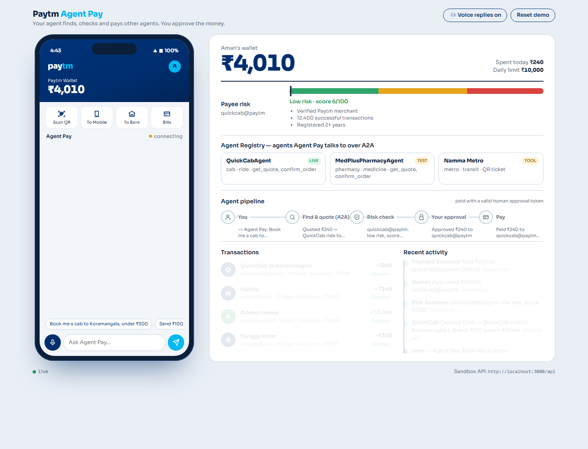
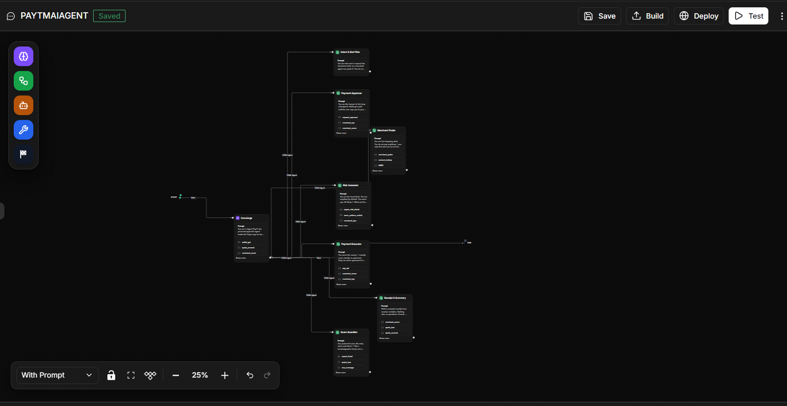
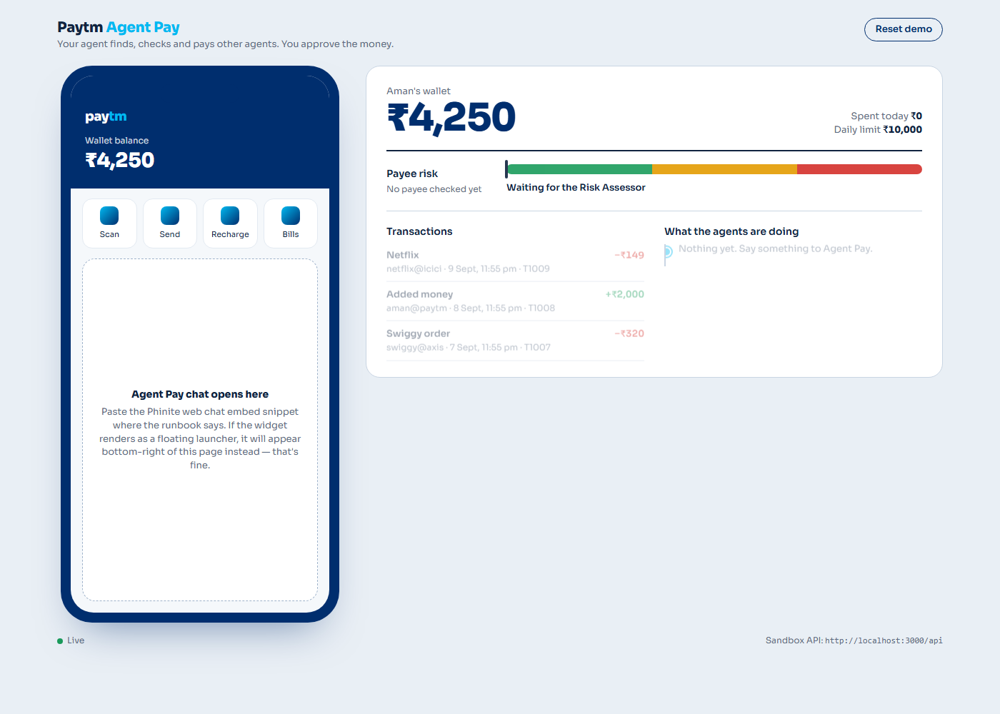
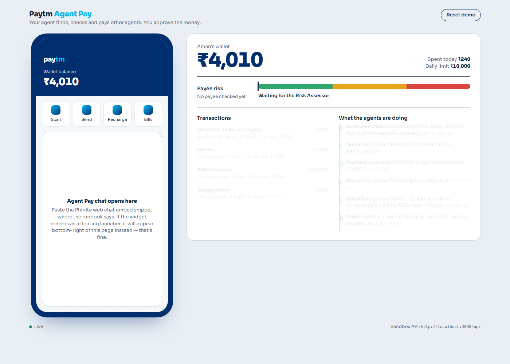

# Paytm Agent Pay

> Built in one day at the **Agent Labs Buildathon — Phinite × Paytm** (Bengaluru, 12 September 2026), Track 1: *AI for Paytm Users*. Solo entry by Aman Gangadhar.

A personal payments agent inside Paytm that **finds and pays other agents, checks who you're paying, blocks scams, and never moves money without your explicit YES** — enforced by a single-use approval token in the backend, not just the prompt.



## What it does

| Say | What happens |
|---|---|
| *"Book me a cab to Koramangala, under ₹300"* | Merchant Finder discovers **QuickCabAgent** in the Phinite Agent Registry (A2A), gets a ₹240 quote → Risk Assessor scores the payee (6/100) → you tap **YES** → Payment Executor pays with the approval token → receipt. Wallet drops on screen. |
| *"Send ₹100 to Rahul"* | Contact lookup → low risk (paid 14× before) → approve → paid. |
| *"Send ₹500 to Arjun"* | Arjun's UPI ID is new to Paytm → **medium risk** warning, you decide. |
| *"Namma Metro from Indiranagar to Majestic"* | Station-graph fare (change at Majestic) → paid → QR ticket. |
| *"Your electricity will be disconnected tonight. Pay ₹1 to update KYC at bescom-update@ybl"* | 96/100, scam pattern matched (RAG on NPCI/RBI advisories) → **refused**, explained in plain language, NPCI-style report filed. Wallet untouched. |
| *"Send ₹15,000 to Rahul"* | Refused — daily limit. |

Voice: hold the mic in the phone frame and speak; replies are read aloud.

## Architecture

```
 Laptop                                              Phinite cloud
 ┌───────────────────────────────┐  Chat API  ┌────────────────────────────────────────┐
 │ Paytm-style demo page         │───────────▶│ PaytmAgentPay (Conversational graph)   │
 │  ├ /api/chat proxy            │            │  Master: Concierge                     │
 │  └ Paytm Sandbox (Express)    │◀───────────│   ├ Intent & Slot Filler               │
 │     wallet · ledger · risk    │  tools via │   ├ Merchant Finder ─ merchant_quote,  │
 │     scam patterns · merchants │  tunnel    │   │                    contact_lookup  │
 │     approval tokens · SSE     │            │   ├ Risk Assessor ─ payee_risk_check,  │
 └───────────────────────────────┘            │   │     scam_pattern_match + RAG       │
                                              │   ├ Scam Guardian ─ report_fraud + RAG │
                                              │   ├ Payment Approver ─ request_approval│
                                              │   ├ Payment Executor ─ pay_upi         │
                                              │   └ Receipt & Summary                  │
                                              │ Agent Registry (A2A): QuickCabAgent    │
                                              │   (LIVE), MedPlusPharmacyAgent (TEST)  │
                                              └────────────────────────────────────────┘
```



**Phinite side:** 1 Master + 7 Child agents (hub-and-spoke), 9 custom Python tools in Dev Studio, RAG collection of scam advisories, session variables between children, two merchant graphs exposed as A2A Agent Cards (QuickCab promoted to LIVE), deployed through the Chat API.

**Laptop side:** Node/Express sandbox that mocks Paytm (wallet, ledger, daily limit, payee-risk table, scam patterns, merchants with deterministic quotes, contacts) and enforces the **approval-token invariant** on `/api/pay`; a demo page with interactive approve / receipt / scam cards, live wallet, risk meter, agent pipeline, and browser voice. Phinite reaches the sandbox through a cloudflared tunnel.

## Screenshots

| | |
|---|---|
|  Demo page on load |  After the first payment (v1 page) |
|  Final page: cards, pipeline, registry |  Agent graph in Phinite Graph Studio |

## Run it

```
cd sandbox && npm install && npm start        # http://localhost:3000
cloudflared tunnel --protocol http2 --url http://localhost:3000   # public URL for Phinite tools
```
Copy `sandbox/chat.config.example.json` → `sandbox/chat.config.json` and fill in your Phinite Chat API integration id and workspace token. Set `SANDBOX_URL` (the tunnel URL) as a Phinite env variable. `npm test` runs the sandbox unit tests.

## Repo map

- `RUNBOOK.md` — the build-day click path (tools → merchant agents → main graph → deploy)
- `sandbox/` — mock Paytm backend + demo page
- `phinite/` — tool code, node prompts, Agent Card copy, RAG doc to paste into Phinite
- `docs/screenshots/` — screenshots above
- `PHINITE_KNOWLEDGE_BASE.md`, `research/docs/` — Phinite platform reference (offline docs)
