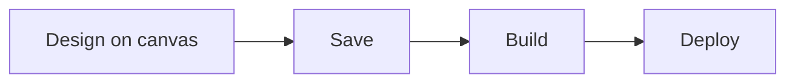

> ## Documentation Index
> Fetch the complete documentation index at: https://docs.phinite.ai/llms.txt
> Use this file to discover all available pages before exploring further.

# Graph Studio overview

> Open Graph Studio, studio layout, graph assets, and the design golden path.

**Graph Studio** is where you design an **Agent Graph** — connect nodes, configure the **node drawer**, and use the toolbar to **Save**, **Build**, **Deploy**, and **Test**. **Phinite Aura** (left sidebar) can generate or edit the graph from chat.

<CardGroup cols={2}>
  <Card title="Methods" icon="sparkles" href="/graph-studio/methods">
    Phinite Aura or manual canvas.
  </Card>

  <Card title="Interface" icon="layout" href="/graph-studio/interface">
    Sidebar Graph assets, drawer, variables, RAG.
  </Card>

  <Card title="Node library" icon="shapes" href="/graph-studio/interface/node-library">
    Palette, types, anatomy, agent configuration.
  </Card>

  <Card title="Connections" icon="arrow-right" href="/graph-studio/connections">
    Handles, edges, conditional branches.
  </Card>

  <Card title="Publishing" icon="hammer" type="note" href="/graph-studio/publishing">
    Save → Build → Deploy.
  </Card>
</CardGroup>

## Open Graph Studio

1. From **Workspace Home**, open an existing **Agent Graph** or click **New Agent Graph**.
2. Enter name and description; choose **Conversational** or **Autonomous** ([Agents overview](/agents/overview)).
3. Click **Create** — Studio opens on the canvas (often with **Phinite Aura** chat open).

<Frame caption="New Agent Graph dialog">
  
</Frame>

<Note>
  Workspace filters may still show an **Email** chip. New graphs only offer **Conversational** and **Autonomous**.
</Note>

## Studio layout (summary)

| Area             | What it does                                                                                     |
| ---------------- | ------------------------------------------------------------------------------------------------ |
| **Left sidebar** | **Phinite Aura**, plus **Graph assets** — Versions, Builds, Cards, Triggers, Integrations, Tools |
| **Canvas**       | Add and connect nodes; floating [node library](/graph-studio/interface/node-library)             |
| **Node drawer**  | Per-node **Details**, **RAG**, **Tools**, **Variables**                                          |
| **Toolbar**      | **Save** → **Build** → **Deploy** → **Test**                                                     |

<Frame caption="Graph Studio — canvas, graph assets, and toolbar">
  
</Frame>

See [Interface](/graph-studio/interface) for sidebar assets, variables, and RAG.

## Golden path

1. Create or open a graph ([Methods](/graph-studio/methods)).
2. Add nodes from the [node library](/graph-studio/interface/node-library) and [connections](/graph-studio/connections).
3. Configure agents in the drawer; set [variables](/graph-studio/interface#variables) and [RAG](/graph-studio/interface#rag) as needed.
4. **Save**, then [Build and deploy](/graph-studio/publishing).

## Related

* [Tools & Dev Studio](/devstudio/overview)
* [Configure integrations](/configure/integrations)
* [Builds overview](/builds/overview)
