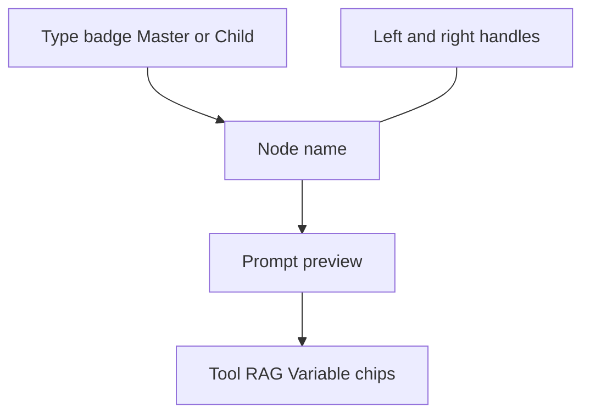
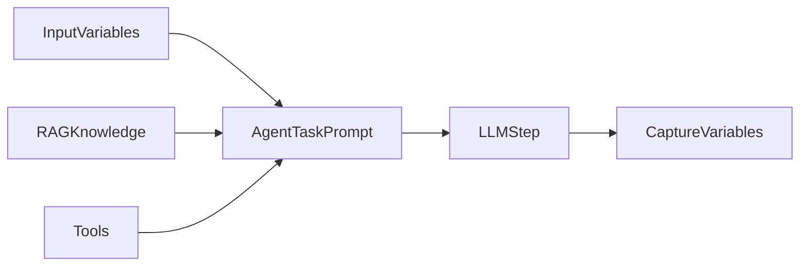

> ## Documentation Index
> Fetch the complete documentation index at: https://docs.phinite.ai/llms.txt
> Use this file to discover all available pages before exploring further.

# Node library

> Floating palette, node types, node anatomy, and Master/Child agent drawer configuration.

The **node library** is the floating palette on the left of the Graph Studio canvas. Use it to place **Start**, **Master Agent**, **Child Agent**, **Tool**, and **End** nodes, then wire them with [handles and edges](/graph-studio/connections).

<Note>
  Older docs called this the **block library**. The product UI uses **node**.
</Note>

## Add a node

1. Click a type in the floating palette.
2. Place the node on the canvas.
3. Connect handles — Start has one outbound; End has one inbound; agents have left/right handles.
4. Double-click Master / Child agents to configure the drawer.
5. **Save** before **Build**.

<Tip>
  Typical skeleton: **Start** → **Master Agent** → **End**, then add Child Agents and Tool nodes.
</Tip>

## Node types

| Node               | Canvas type                     | Place from library? | Role                                                                                |
| ------------------ | ------------------------------- | ------------------- | ----------------------------------------------------------------------------------- |
| **Start**          | `start`                         | Yes                 | Entry — one outbound handle; minimal config                                         |
| **Master Agent**   | `task` (badge **Master Agent**) | Yes                 | Orchestrator — full drawer; registry Browse / Discovery                             |
| **Child Agent**    | `child` (badge **Child Agent**) | Yes                 | Delegated sub-task — Purpose + full drawer                                          |
| **Tool**           | `tool`                          | Yes                 | Published tool without an LLM step                                                  |
| **End**            | `end`                           | Yes                 | Terminal — run completes                                                            |
| **Registry agent** | Browse / Discovery              | No                  | Attached from Master — [Registry agent nodes](/agent-registry/registry-agent-nodes) |

Example graph (GitHub Repository Search): **Start** → Keyword Extraction (`task`) → Master Coordinator (`task`) → Child Markdown (`child`) → **End**.

<Frame caption="Canvas with Start, Master, Child, and End">
  
</Frame>

### Start node

Exactly one per graph. Compact entry pill — outbound handle only. No orchestration model, tools, or RAG.

### Master Agent node

Primary orchestrator. Drawer tabs: **Details**, **RAG**, **Tools**, **Variables**. Can attach registry **Browse** / **Discovery** agents.

### Child Agent node

Delegated specialist. Same drawer tabs as Master, plus **Purpose of this child agent** on Details. Tool chips (for example `markdown_compilation_tool`) usually live here.

### Tool node

Executes a **published** tool without an LLM step. Map inputs in the drawer. Publish tools from [Tools & Dev Studio](/devstudio/overview) before **Build**.

Many graphs attach tools on Master / Child drawers instead — both patterns are valid.

### End node

Marks successful completion. Inbound handle only. Every branch should reach **End**.

### Master vs Child

|                                 | Master                         | Child       |
| ------------------------------- | ------------------------------ | ----------- |
| **Badge**                       | Master Agent                   | Child Agent |
| **Purpose field**               | —                              | Yes         |
| **Registry Browse / Discovery** | Yes                            | No          |
| **Drawer tabs**                 | Details, RAG, Tools, Variables | Same        |

## Node anatomy

| Part                            | What it is                                                              |
| ------------------------------- | ----------------------------------------------------------------------- |
| **Type badge**                  | **Master Agent**, **Child Agent**, or compact Start / End / Tool chrome |
| **Name**                        | Editable display name                                                   |
| **Prompt preview**              | Truncated Agent Task Prompt (**Show more**)                             |
| **Tool / RAG / variable chips** | Attachments from the drawer tabs                                        |
| **Handles**                     | Drag to create [edges](/graph-studio/connections)                       |
| **Selection / Delete**          | Footer shows **Selected: …**; undo available after delete               |

Labeled edges (for example `parameters_extracted`) sit on connections — not on the node body. See [Connections](/graph-studio/connections).

## Configure Master / Child (drawer)

Double-click an agent node to open the inspector.

### Details tab

1. Set **Orchestration Model** (for example `gpt-4.1` or `gemini-2.5-pro`).
2. Write the **Agent Task Prompt** in Markdown (or **Formatted**).
3. Use **Refine Prompt** for Aura-assisted edits.
4. On Child Agents, fill **Purpose of this child agent**.

<Frame caption="Master Agent — Details tab">
  
</Frame>

### Tools tab

1. Open **Tools** → **Add a new tool**.
2. Pick from **Tools** (workspace), **Integrations**, or **MCP Servers**.
3. Map inputs from variables (see [Interface — Variables](/graph-studio/interface#variables)).
4. **Save** the graph.

<Frame caption="Child Agent — Tools tab">
  
</Frame>

<Frame caption="Add a new tool — workspace catalog">
  
</Frame>

Unpublished tools show **Publish** in the **Build Agent** dialog.

### RAG tab

Attach knowledge for this step only — **Attach Files** or collections from workspace **RAG Data**. See [Interface — RAG](/graph-studio/interface#rag).

<Frame caption="RAG tab — Attach Files">
  
</Frame>

### Variables tab

* **Input Variables** — map flow / session into the step (**Pick from Session variables**).
* **Capture Variables** — fields the model extracts (**Create a variable**).

Full variable layers: [Interface — Variables](/graph-studio/interface#variables).

### Registry agents (Master only)

Attach **Browse** (fixed catalog agent) or **Discovery** (filter-matched). Only **one Discovery** per Master Agent. See [Registry agent nodes](/agent-registry/registry-agent-nodes).

## Configure checklist

1. Place nodes from the palette.
2. Complete drawer tabs: **Details** → **Tools** → **RAG** → **Variables**.
3. Label outbound edges for branches ([Connections](/graph-studio/connections)).
4. **Save** the graph.

## Related

* [Interface layout](/graph-studio/interface) — sidebar Graph assets, toolbar, variables, RAG
* [Connections](/graph-studio/connections)
* [Publishing](/graph-studio/publishing)
